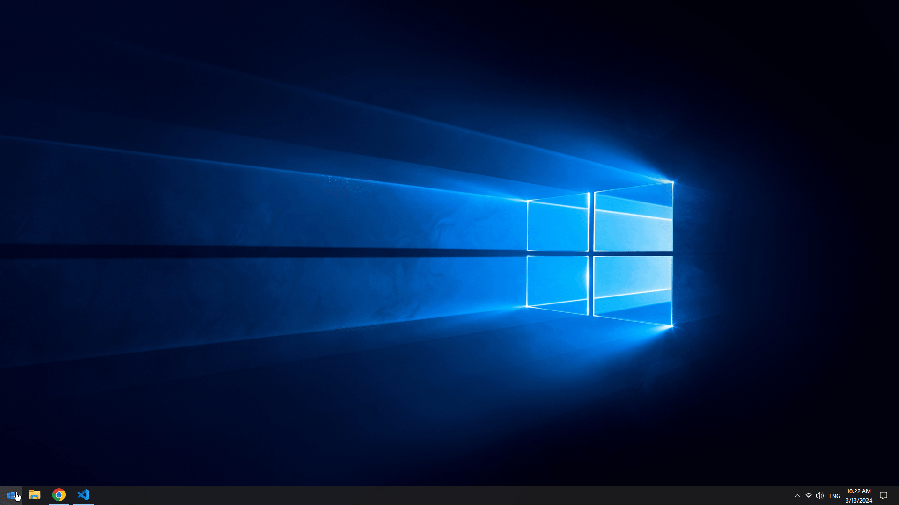

# Windows Desktop Clone with React

This project is a simple attempt to recreate the Windows desktop experience using React. It's far from complete and serves primarily as a learning exercise for React and Tailwind CSS.

## Installation

1. Clone this repository.
2. Navigate to the project directory.
3. Run `npm install` to install dependencies.
4. Run `npm run dev` to start the development server.
